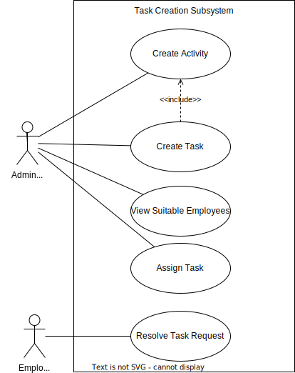

# Deliverable 1

## Team Name: Lambda++

## Team Number: 18

## Sponsor: EPI-USE

## Project title: EPI-USE Game Farm Manager

## Team Members

Gage Nott

Ariel Sischy

Kevin Kiyo

Abuzar Bulbulia

___

## Background

### **Introduction and Company/Industry Background**

Rhinos and elephants are keystone species in their respective ecosystems. Their presence and health affect the survival and well-being of other species - for example, elephants are known as "gardeners of the forest" as they maintain the balance of the ecosystem by shaping the landscape and allowing for new growth. Rhinos, on the other hand, contribute to the growth of grasslands by grazing and trampling.
Elephants and rhinos also contribute to the economy through ecotourism, impacting the livelihoods of local communities.

Conservation efforts - such as habitat restoration, anti-poaching measures, community education, and support for sustainable development - are essential to preserving these species. Conservation projects such as the ERP Melorane Game Reserve, a pristine habitat for elephants and rhinos next to the greater Madikwe Reserve, are making a tangible difference in protecting these magnificent animals and their habitats.

EPI-USE operates under [groupelephant.com], which is centred around a business model trying to go *"Beyond Corporate Purpose"*. ERP (Elephants, Rhinos, and People) is the non-profit arm of EPI-USE and executes various preservation and upliftment programs, such as keeping Melorane Game Reserve in good condition.

The reserve is a registered game reserve that seeks to support the local communities nearby and protect rhinos and elephants in the conservation area. Efforts are done to maintain dams, implement an anti-poaching model to protect the elephants and rhinos, protect the trees in the area and educate and feed the surrounding community.
As an example of the kinds of initiatives run by the reserve, apiaries are used to direct elephants to avoid certain areas such as villages or endangered trees, and the honey produced provides revenue to the community.

ERP seeks to concentrate on this particular reserve and track progress, measure the impact of our interventions, and work closely with local communities, who are crucial partners in conservation efforts. By collaborating with them, we can develop sustainable solutions that support both wildlife and people.
ERP is then hoping to franchise this model and create similar reserves in future, based on the impact and performance of this reserve.

Overall, the conservation efforts for rhinos and elephants implemented at Melorane are of critical importance for their survival, the health of their ecosystems and the well-being of local communities. Our project seeks to support this effort and ensure that the reserve is able to succeed in its goals. Although our system would only be a small part of it, we hope to contribute to their conservation and inspire others to take action to protect these amazing creatures. The specifics regarding our team's exact involvement in this enterprise will be elaborated on and made manifest in our problem statement and proposed solution.

### **Systems Systems Currently In Place**

The Melorane Game Reserve has been operating with a relatively primitive set of systems for quite some time. While the reserve has been successful in its efforts to protect the wildlife and preserve the natural habitat, the current processes for task allocation and tracking, administrative decision-making, and data collection are all manual, relying on Microsoft Excel spreadsheets and Word documents. This makes it a tedious and time-consuming process to manage resources, stock, and equipment effectively.
Meanwhile, communication on which tasks must be done, what equipment is being used, whether tasks have been completed successfully etc. are all done via WhatsApp on an ad-hoc basis.
In other words, the organisation is currently running at an informal, Level 1 basis on the Levels of Capacity Maturity Model ([1]), meaning processes are not clearly defined or repeatable.

Moreover, with rapid advancements in technology, there is growing concern that the current systems might not be sufficient for the changing needs of the reserve. For instance, the lack of automation in data collection limits the staff's ability to collect, process, and analyse critical information, hindering the overall success of their conservation efforts.

The Melorane Game Reserve needs to adapt to the changing needs of the conservation industry and invest in more advanced and efficient systems. This would enable them to track and manage their resources more effectively, reduce manual errors, and improve their overall efficiency. By implementing modern technology, they would be able to keep pace with the ever-evolving conservation landscape and continue to make a positive impact on the environment. Our goal is to make this transformation possible through the system we plan on developing, which will automate the aforementioned tasks and activities.

### **Problem Statement**

The Melorane Game Reserve now employs only one administrator, making it difficult for her to manage farm activities in a timely and effective manner. There is no formal system in place to track operations and assign activities and projects to ERP employees. Secondly, there is no system in place to track the various employees' skill sets and their availability. As a result, when picking an employee for a certain task or activity, they may not be the best fit for the task at hand. Furthermore, there are no formal means to track the stock and equipment needed for specific tasks or to examine what is in the storeroom before requesting a purchase.

### **Proposed Solution**

We seek to develop a system that will enable the management of work activities and supplies. This will consist of an administrative site to create and monitor activities and stock, as well as a mobile application to allow employees to keep track of the activities they do and changes to the stock.
This should make it much easier for the administrator to manage the completed, in progress, and upcoming farm activities and keep track of what is going on. It should also empower her to make decisions based on up-to-date information and the monitored performance of employees.
It should also eliminate issues with stock shortages or wasted time due to miscommunication and lack of organisation.

___

## Requirements Extraction

### **Functional Requirements**

1. The system must contain a database with a list of existing activities that need to be completed, in addition the database should contain information regarding the skills of the employees.
2. The administrator of the system must be able to add employees into the system via registration links.
3. The employees must be able to upload documents and information about themselves, and update their information at any time.
4. The administrator of the system must be able to create new activities and sub-tasks inside the activities, and must stipulate further specificities regarding the given activity.
5. The administrator must have the ability to populate the skills needed for each activity in the database, by selecting from the existing skills available, they should also have the option to add new skills should this become a requirement.
6. The administrator must be able to view a timeline of upcoming activities and tasks, as well as view employee availability schedules.
7. The administrator must be able to assign certain ERP employees to certain tasks, and optionally set an employee as the supervisor of the task.
8. When the administrator is assigning employees, the system should suggest the best employees for the task based on their skills, rating and availability.
9. If no suitable employee is available for a certain task, an external contractor can be assigned to the task.
10. Each employee must have access to the mobile application, where they will be able to see the activities and tasks assigned to them as well as the timeframe for the tasks.
11. The employee will be notified if they are assigned to a task, and must respond to the notification by either accepting or declining the request with a comment.
    - If the employee accepts the request, then the app must automatically add this task to their calendar.
    - If the employee declines the request, the app should notify the administrator of the declination and should suggest other suitable employees that can be assigned.
    The employee will also be able to suggest a suitable replacement - either another employee or an external contractor.
12. Employees must be able to specify the equipment and stock needed to fulfil the task that they have accepted.
13. The equipment and tools list should be a prepopulated database table of existing items, tracking their relevant details. If the item is not available then the item can be requested by an employee and the administrator will receive a notification.
14. The app should have functionality to track the stock, equipment and tools that are kept in the warehouse.
    - When a consumable product such as paint or wood is taken from the warehouse, the employee must indicate this on the app so that the system count can automatically update.
    - If stock levels are low for any given item on the system, the administrator should receive a notification.
15. The employees must be able to request an extension on a given deadline if the need arises, it will be the job of the administrator to assess the outcome of the request.
16. The employees must be able to mark tasks as complete and give feedback, provide evidence or comment on the task's completion.
17. The administrator or the supervisor of the task can sign off on the completion of the task and rate the employees' performance.
18. The administrator should have access to dashboards with relevant statistics regarding the employees, tasks, skills, performance and stock as well as be able to extract customisable reports on these.

### **Non-Functional Requirements**

**Security**: The system should be secure such that only authorised users will obtain access to the app as confidential information is stored therein. Certain users *(such as administrators)* will have access to more functionality due to their role. To achieve this, the system will make use of an encryption protocol, such as TLS *(Transport Layer Security)* when storing and retrieving data from the database. For logical access, the use of passwords, biometrics and perhaps even multi-factor authentication will also be used to ensure the highest levels of security. The system should ideally meet the requirements of *ISO 27001* ([2]), which is an international standard for information security.

**Reliability**: The system should perform what is required at any given time. Furthermore, all data generated by the system should be accurate and correct. The system should have a 99% reliability rate, meaning that under normal usage conditions, there's a 99% chance that the system won’t experience any glitches, crashes or even critical failure. To achieve this, the system will make use of internal hosting because, at most, only 10 people will be using the system at any given time and the company has onsite expertise to manage the hosting. Thus, the reliability of the system can be guranteed since most aspects of the system are controlled by the company. The system should ideally meet the *IEEE Standard for Software Reliability* ([3]), which outlines guidelines for implementing and testing reliability in information systems.

**Usability**: The system should be ergonomic and intuitive. A minimal number of clicks should be needed to perform most actions. A good metric for the number of clicks to create a new task in the average project management system is 3-4 clicks. The updating and completion of tasks will take at most another 3-4 clicks *(outside of typing, taking pictures etc.)*. The system should have a simple and easy-to-use interface, make use of a good light theme *(as the app is likely to be used outdoors most of the time)*, quick authentication and a response time of under 1s *(provided there is good internet coverage on the reserve)*. The system should ideally meet the requirements of *ISO 9241* ([4]), which is an international standard that provides guidelines for designing user-friendly interfaces.

___

## Use Cases

### Task Creation

### Task Management

### User Management

### Stock Management

___

## Feasibility Study

### **System Feasibility**

The core of our program is a project management tool. While there are many options available on the market, such as Monday.com, Wrike, Slack, and even Microsoft Teams and Github ([5]), our system will be designed specifically for field workers. It must be simple and quick for employees to update their tasks on the go using a mobile application.

Additionally, the system must have built-in functionality for tracking stock and equipment usage to mitigate conflicts regarding multiple teams requiring the same equipment simultaneously.
Although systems such as UpKeep and Monday.com ([6]) have stock management functionality, they may include unnecessary features that make them slower for employees to learn and harder to use in the field.

Finally, as Melorane Game Reserve is an ERP's "Flagship Project" ([7]) a custom-built and internally-owned system would be preferable to licensing third-party software as it allows for future extensions and modifications of the system to suit their purposes and plans for expansion.

At the moment, task allocation, admin-decision-making and equipment management are all done manually via Microsoft Word and Excel. Team communication and reporting of tasks are done via WhatsApp. It is clear that this system should be replaced as this lacks tracking/recording capabilities, reporting capabilities, etc. As well as being very manual, which leaves much room for user error. It is clear this ad-hoc system must be replaced by something more formal.

Considering these factors, the development of the system is recommended over the use of alternatives and is definitely an improvement over the currently implemented systems.

### **Technical Feasibility**

#### ***Hardware***

Workers will primarily interact with the system through handheld devices as they are the most portable and already carried around by the workers, minimising changes to their daily routine. This portability is important as the workers will likely interact with the system multiple times throughout the day, as they accept or complete tasks, etc.
We are limiting our mobile application to run on Android devices for now, as the workers primarily use Android devices. It may be wise to create a version for iOS in the future, but this is not important functionality for the initial version of the system.
Initially, the workers are likely to use their own private devices. Due to this, the devices may have storage space and processing power limitations. The software must therefore avoid being too processing intensive and must not take up too much storage space. This should not be a problem as the bulk of data storage will take place in the database, not on the client device, and most processing and logic will be done on the API.

Only the administrator primarily works on a desktop, however they are often also in the field throughout the day.

Server hosting will be required as all workers and the administrator will access and update the same data from the database and will make use of the same API functionality. Servers may be hosted externally via a third party using cloud computing or renting a rack, or they may be managed internally. Both have advantages and disadvantages, however after review, internal hosting seems to be the ideal solution. This is because the system can then operate even if the internet connection is down, because it can operate via the internal network of the reserve. This reliability is important as it is one of our key non-functional requirements.
The server hardware need not be expensive or advanced. As there will only ever be around 10 simultaneous users of the system, a dedicated server setup is not needed. A normal desktop computer would be able to run the server software and API without issue.

#### ***Software***

Workers will require a mobile application to be able to work portably. As most workers use Android devices, our initial version of the system will be on Android. Supervisors will make use of the same software as workers, with a few additional functions such as rating other employees based on their performance.
For the administrator, we will create a web application for their administrative functionality, such as assigning tasks, and managing employees and stock. As the administrator has more functionality available and serves a more active role than the other employees, a web application is the most sensible solution.
It allows for a more complex interface than a mobile application and allows for easier complex interactions.
A web application is preferable to a desktop application as it:

Allows for the administrator to work off any desktop without having to download software.
Requires internet access, which is essential for API access.
As they are often out in the field, it is important that they do have some mobile capabilities, for everyday tasks such as viewing the statuses of tasks being completed.

### **Economic Feasibility**

Melorane Game Reserve is an ERP project funded through a portion of the revenue of GroupElephant ([8]), ERP's parent company. ERP seeks to be "run with the discipline of a business" ([9]) and supports new systems to pursue potential solutions to the problems they encounter.

To estimate the development costs of the system, the following information must be considered:
Assuming a team of 4 junior developers working at a salary of R20 000 per month ([10]) for the 8-month development cycle we are limited to, the total cost of salaries would be R640 000.
Initially, no equipment such as phones or desktop PCs will need to be provided to the workers as this infrastructure already exists.
It would likely not be necessary to spend funds to improve the internet connectivity at the reserve. Currently, communication is done via WhatsApp, including the sending of images as proof that tasks are complete. The new system would not be very different in terms of data usage and file transfer size, and thus the existing infrastructure should be plenty for initial implementation.

With regards to long-term support costs, a more thorough breakdown will be included in later deliverables.
However, it is important to note that EPI-USE has the existing infrastructure and internal developers on hand whom they will rely on for upkeep and support of the system.
It is clear that EPI-USE is in a position where they are able to afford the development and maintenance costs of the system, if they choose for it to be developed and implemented.

### **Operational Feasibility**

For most employees using the system, interaction will be straightforward. Employees will typically accept tasks, take note of the equipment they are using, and record the progress and completion of the tasks. Basic training may be required, but no advanced knowledge is necessary. Making the usage of the app quick and simple is a core design goal, resulting in the system being easy to learn.
In all likelihood, less than 2 hours of walkthrough will be required for users to make use of the system. The administrator will have more complex functionality and will need to be shown how to use the software. A manual to refer to whenever guidance is needed would be wise until the administrator is fully comfortable with the system. The administrator is already familiar with the workings of the business, so no formal training would be required apart from this.
Measures will be implemented to ensure that the equipment records match reality, and that the employee's information and skills recorded in the database are accurate.
The project managers believe that this system will make a real difference to the day-to-day operations of the reserve. Currently, the best employees for the job aren't always assigned to the right jobs, and they believe this system will change that.

In conclusion, it seems the system will be practical for the users to learn to use, and will be worth implementing to make a positive change in the daily activities of the employees involved in the process.

[1]: <https://www.geeksforgeeks.org/levels-of-capability-maturity-model-cmm/> "Levels Of Capacity Maturity Model"
[2]: <https://www.iso.org/standard/82875.html> "ISO/IEC 27001"
[3]: <https://ieeexplore.ieee.org/document/7827907> "IEEE Recommended Practice on Software Reliability"
[4]: <https://www.iso.org/standard/63500.html> "ISO 9241"
[5]: <https://www.top10.com/project-management/> "Top 10 Project Management Software"
[6]: <https://www.capterra.com/sem-compare/inventory-control-software/> "Inventory Control Software Comparison"
[7]: <https://www.erp.ngo/updates/2021/12/21/erp-melorane-game-reserve> "Melorane Game Reserve"
[8]: <https://www.groupelephant.com/> "GroupElephant"
[9]: <https://www.erp.ngo/> "Elephants, Rhinos & People"
[10]: <https://www.payscale.com/research/ZA/Job=Junior_Software_Engineer/Salary> "Average Salaries for Junior Software Engineers"
[groupelephant.com]: <https://www.groupelephant.com/> "GroupElephant"
