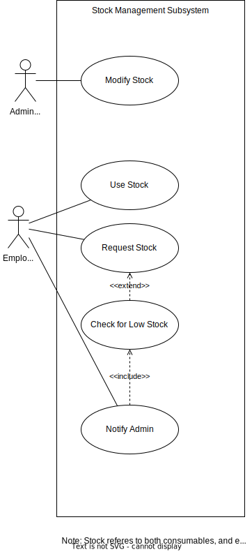

# Deliverable 2

## Team Name: Lambda++

## Team Number: 18

## Sponsor: EPI-USE

## Project title: EPI-USE Game Farm Manager

## Team Members

Gage Nott

Ariel Sischy

Kevin Kiyo

Abuzar Bulbulia

___

## Background

The Melorane Game Reserve ([1]) is a habitat for elephants and rhinos that works in tandem with the Barokologadi Community. The goals of the reserve are to create economic opportunities for the community and to serve as a nature reserve for the wildlife. ERP (Elephant, Rhinos and People) ([2]), the nonprofit organization in charge of this reserve, started this project in 2021 and has a 90-year lease, meaning this reserve is a long-term strategic project. ERP (working under GroupElephant.com ([3])) also plans to franchise this model for future conservation efforts.

Currently, the reserve typically handles fewer than 30 concurrent employees, but with a high likelihood of expansion. The employees often work far apart, spread across the reserve, but often work together in teams on tasks. There is currently only a single administrator.

### **Problem Statement**

It is difficult for the sole administrator to manage activities across the reserve. There is no formal system in place to assign activities to ERP employees and track progress, leading to miscommunication and disorganization. Furthermore, there is no system to track the various employees' skill sets and availability, resulting in scheduling conflicts and mismanaged skillsets when tasks are assigned. This leads to wasted time and effort to sort out these issues. Finally, there are no formal means to track and request stock and equipment for a task or for the administrator to manage these resources. This, again, leads to wasted time and effort due to conflicts over resources.

### **Proposed Solution**

We seek to develop a system that will enable the management of work activities and supplies. This will consist of an administrative site to create and monitor activities and stock, as well as a mobile application to allow employees to keep track of the activities they do and changes to the stock.
By the construction of the administrative site, it should be much easier for the administrator to manage the completed, in progress, and upcoming farm activities and keep track of what is going on. The extensive reports the system generates should empower the administrator to make decisions based on up-to-date information and the monitored performance of employees.
The ability to track the stock and equipment will allow informed decisions to be made about what stock to buy, how to schedule the usage of limited equipment, and keep track of which tasks use certain resources and how much.

The mobile application will enable employees to interact with this system on the go, as they are typically outdoors across the reserve. They will be able to keep track of what tasks they are assigned to, whom they are working with, the associated locations and deadlines, the status of the task and any updates that are made to it.
It will allow for clear and concise communication on the task's progress between task members themselves and with the administrator. It will also allow for formalised requests to be made to the administrator, for example for stock/equipment, or for extensions to the deadlines.
An administrative branch of the app will also be required as the administrator is often outside too. This will allow for them to be kept up to date on the status of the tasks and any requests made by employees.

___

## Use Cases & Use Case Descriptions

### **Use Case Diagram: Task Creation**

### Use Case Description: View Suitable Employees

**Input**
-  Set of skills required for the task.

**Output**
- Specific user(s) recommended for the task.

**Process**
1. The administrator enters the required skills needed to complete a task.
1. The system recommends suitable users (employees, contractors, supervisors) for the task (based on their rating and relevant skills).

### Use Case Description: Assign Task

**Input**
- User(s) selected. 

**Output**
- User(s) will be assigned to the task. 

**Process**
1. The administrator will view and select suitable user(s) for the task. 
1. The system will notify the user of the task.
1. The system adds the user to the task and notifies the administrator.

### Use Case Description: Create Activity

**Input**
- Parameters of activity. 

**Output**
- Newly created activity.

**Process**

1. The administrator enters the parameters of the activity (name, description and tasks).
1. The system creates the activity and assigns the given tasks to it.

### Use Case Description: Create Task

**Input**
- Parameters of task. 

**Output**
- Newly created task.

**Process**
1. The administrator enters the parameters of the task (name, requirements, and stock needed).
1. The administrator assigns the task to suitable user.

### **Use Case Diagram: Task Management**

### Use Case Description: Display Current Task(s)

**Input**
- User logs on to the mobile app.

**Output**
- Current task(s) to be completed is displayed.

**Process**
1. User log on to the app using their credentials.
1. Click on the current task(s) allocated to the user. 
1. View status of current task(s) (assigned, in progress, completed). 

### Use Case Description: Give Update On Task

**Input**
- A task is viewed by the user. 

**Output**
- Update is given regarding the task. 

**Process**
1. User views a certain allocated task. 
1. The user provides an update on the task.
1. The system updates the task’s timeline.

### Use Case Description: Request Removal from task

**Input**
- User will request to be removed from the task.

**Output**
- Administrator will either accept ot reject removal request.

**Process**
1. The user will decide that they can no longer work on a certain task.
1. They will send a notification to the administrator citing their reasons for the requested removal.
1. The administrator will review their request.
1. The administrator will accept or reject the request.
1. The user will be notified regarding the outcome of their request.

### Use Case Description: Request Extension

**Input**
- The user requests a time extension for a task.

**Output**
- A notification requesting an extension is sent to the administrator.

**Process**
1. The user enters their reasoning for why they need an extension, and for how long it will be.
1. The system sends a notification to the administrator requesting an extension of the deadline for the task. 

### Use Case Description: Resolve Extension

**Input**
-  Extension request is received. 

**Output**
- Extension request is either accepted or declined. 

**Process**
1. The administrator receives a request for an extension and reviews the request. 
1. The administrator either accepts or rejects the extension.
1. The system will notify the user stating whether the extension has been approved or rejected.

### Use Case Description: Rate Employee

**Input**
- The administrators’ supervisors’ and other employees rating for the user. 

**Output**
- The users overall rating is updated. 

**Process**
1. The supervisor signs off on a task.
1. The supervisor and administrator will give the user a rating based on their performance.
1. The other employees that were assigned to the task will also rate the user based on their contribution to the completion of the task.
1. The rating will include feedback on what the user did well, and what they can improve on. (As an employee will not be able to see their given rating for a task, only feedback).
1. The system will notify the user that the task is officially completed.

### Use Case Description: Remove Employee From Task

**Input**
- User requests to be removed from task.

**Output**
- The user is removed from the task.

**Process**
1. The user requests to be removed from the task due to some valid reason.
1. The administrator reviews the request.
1. The administrator accepts the request.
1. The user is removed from the task.
1. The user is notified.
1. The system is updated and the user is no longer listed is being part of the task.

### Use Case Description: Give Feedback On Task

**Input**
- Employee Completes Task.

**Output**
- Employee gives feedback on task.

**Process**
1. Administrator will assign employee to a task.
1. Employee must complete task.
1. Employee must provide administrator with feedback regrading the task(status of task, obstacles and challenges, future advice etc).

### Use Case Description: Complete Task

**Input**
- The employee accepts a certain task. 

**Output**
- The employee provides evidence that the accepted task has been completed. 

**Process**
1. The employee receives a notification about a task that has been assigned to them. 
1. The employee is able to request to be removed from the task. 
1. The employee periodically provides updates on their progress, and is able to request additional stock.
1. If the employee is unable to finish the task in the stipulated time, they may request an extension on the deadline.
1. Once the task is finished, the employee marks the task as done.
1. The employee must provide evidence that the task has been completed (pictures and/or text). 
1. The system notifies the supervisor of the task being marked as done.
1. The supervisor views the evidence, and marks the work as complete or incomplete.
1. The system will notify the employee if they must still complete the task, or if it is complete.
1. The employee is rated.
1. The employee provides feedback on the task. (What they’ve learnt, what went well, what they can do better in the future, and any other comments).

### **Use Case Diagram: User Management**

### Use Case Description: Enter Credentials

**Input**
-  User enters credentials.

**Output**
-  Validity of entered details.

**Process**
1. The user enters their registration credentials (Name, surname, ID number, password).
1. The system will evaluate the validity of details entered.
1. The system will either log the user in, or store the credentials as a new user.

**Extensions**

2a. Users will enter details in incorrect format.
1. Error message will be displayed.
1. Users will be prompted to re-enter incorrect field(s).

### Use Case Description: Upload Documents

**Input**
- Documents will be selected.

**Output**
- Documents will be uploaded.

**Process**

1. The user clicks on “Upload”.
1. The user browses devices for documents to upload.
1. The user selects relevant documents (ID, certificates, CV/Passport).
1. The user presses open to attach documents.
1. The user uploads documents.

**Extensions**

3a. No document was selected.
1. Error message will be displayed.
1. Users will re-select documents.

### Use Case Description: Register User

**Input**
-  Administrator will generate and send registration link.

**Output**
-  Employee/contractor will open the link and complete the registration process.

**Process**
1. The administrator will enter the user’s email address.
1. The system will send a registration link to the email address.
1. The new employee (user) will open the registration link, redirecting them to the registration page.
1. The user will enter the necessary credentials (registration info, such as the username and password they will use).
1. The user will upload necessary documents.
1. The system will notify the administrator of the successful registration.
1. The system will add the user as an employee or contractor.

**Extensions**

4a. Details entered are incorrect.

1. Error message will be displayed.
1. Users will be prompted to re-enter details.

5a. Documents are not selected.

1. Error message will be displayed.
1. Users must re-select documents.

### Use Case Description: Edit User Details

**Input**
-  User changes certain details.

**Output**
-   Changes are saved, and the system is updated.

**Process**
1. The user logs on to the app.
1. The user clicks on the profile.
1. The system retrieves the user's details.
1. The user clicks on edit profile.
1. The user alters their details and/or uploads additional documents (i.e. certificates).
1. The user clicks on save changes.

**Extensions**

3a.  Changes could not be saved.

1. Error message will be displayed informing the user that changes have not been saved.

### Use Case Description: Delete Employee/Contractor

**Input**
-Search for employee/contractor.

**Output**
-  Employee/contractor is deleted from system.

**Process**

1. The administrator will search for a specific employee/contractor.
1. The system will retrieve the users information.
1. The administrator will click “Delete User".
1. The user will be marked as deleted from the system.

**Extensions**

4a.  Changes could not be saved.

1. Error message will be displayed informing the user that changes have not been saved.

### **Use Case Diagram: Stock Management**

### Use Case Description: Modify Stock

**Input**
- New stock is entered.

**Output**
- Stock level is changed.

**Process**
1. The administrator will go to “Add Stock”.
1. The administrator will input newly acquired stock to the system.
1. The system will modify stock levels.
1. The administrator will be notified regarding the status of the new stock input.

**Extensions**

2a.  The system will reject the new stock.

1. Error message will be displayed.
1. Administrator must re-enter new stock items.

### Use Case Description: Use Stock

**Input**
- Stock is used.

**Output**
- Stock level is modified.

**Process**
1. The user will input stock used.
1. The system will notify the administrator about the stock being used.
1. The administrator will make the relevant changes to the stock level(s).
1. The system will store the new stock levels.

**Extensions**

2a.  The system will reject the used stock.

1. Error message will be displayed.
1. Administrator must re-enter used stock items.

### Use Case Description: Request Stock

**Input**
- User will request stock.

**Output** 
-  Administrator will accept or reject the request.

**Process**
1. The user requests stock for a task.
1. The system will notify the administrator of the request.
1. The administrator will either accept or reject the request.
1. The system will notify the user of the request result.
1. If the request is accepted, the system will calculate if the requested stock is low.
1. If the stock is low, the system will notify the administrator of the low stock.

### **Use Case Diagram: Report**

### Use Case Description: Generate Report

**Input**
- Report type selected.

**Output** 
-   Report generated for selected report.

**Process**
1. The administrator will select the report to be generated (Task, Employee or Stock Report).
1. The administrator will input parameters for which report needs to be generated.
1. The system will generate the report based on selected parameters, and provide it to the administrator to view. 

**Extensions**

2a. Defined parameters have no data to generate a report.

1. Error message will be displayed.

___

## Activity Diagrams

### Activity Diagrams for Task Creation Use Cases

#### **Create Activity**

#### **Create Task**

### Activity Diagrams for Task Management Use Cases

#### **Remove User from Task**

#### **Rate User**

#### **Complete Task**

### Activity Diagrams for User Management Use Cases

#### **Log In**

#### **Register User**

#### **Edit User Profile**

#### **Delete User**

### Activity Diagrams for Stock Management Use Cases

#### **Add Stock**

#### **Use Stock**

#### **Request Stock**

### Activity Diagrams for Report Use Cases

#### **Generate Report**

___

## Database Design

___

## Footnotes
1. https://www.erp.ngo/updates/2021/12/21/erp-melorane-game-reserve
2. https://www.erp.ngo/
3. https://www.groupelephant.com/

[1]: <https://www.erp.ngo/updates/2021/12/21/erp-melorane-game-reserve> "Melorane Game Reserve"
[2]: <https://www.erp.ngo/> "Elephants, Rhinos & People"
[3]: <https://www.groupelephant.com/> "GroupElephant"
