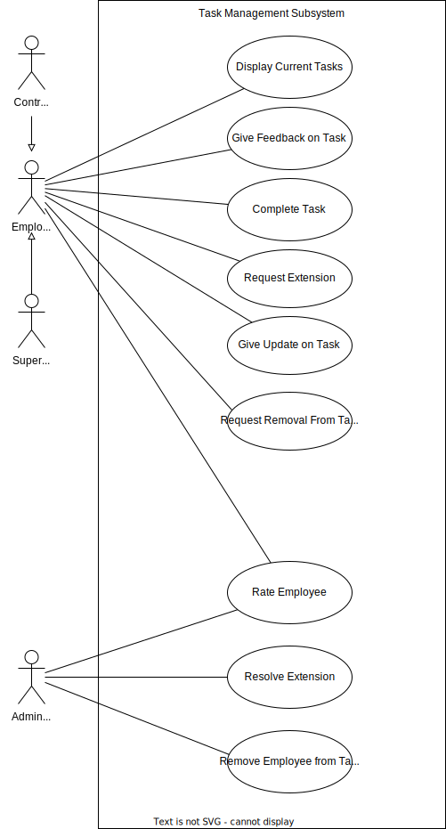
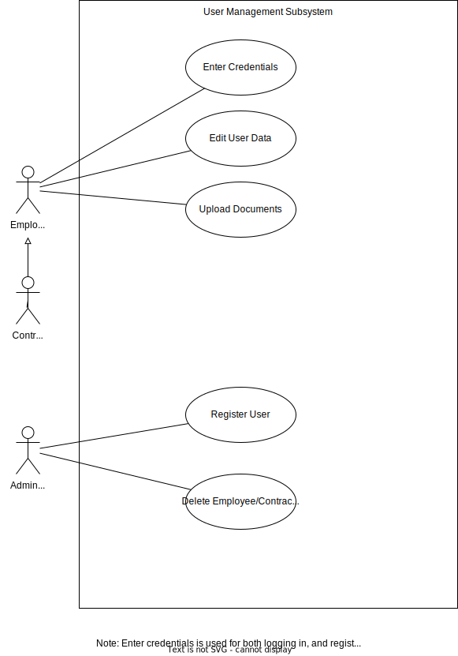

# Deliverable 3

## Team Name: Lambda++

## Team Number: 18

## Sponsor: EPI-USE

## Project title: EPI-USE Game Farm Manager

## Team Members

Gage Nott

Ariel Sischy

Kevin Kiyo

Abuzar Bulbulia

___

## Background

The Melorane Game Reserve ([1]) is a habitat for elephants and rhinos that works in tandem with the Barokologadi Community. The goals of the reserve are to create economic opportunities for the community and to serve as a nature reserve for the wildlife. ERP (Elephant, Rhinos and People) ([2]), the nonprofit organization in charge of this reserve, started this project in 2021 and has a 90-year lease, meaning this reserve is a long-term strategic project. ERP (working under GroupElephant.com ([3])) also plans to franchise this model for future conservation efforts.

Currently, the reserve typically handles fewer than 30 concurrent employees, but with a high likelihood of expansion. The employees often work far apart, spread across the reserve, but often work together in teams on tasks. There is currently only a single administrator.

### **Problem Statement**

It is difficult for the sole administrator to manage activities across the reserve. There is no formal system in place to assign activities to ERP employees and track progress, leading to miscommunication and disorganization. Furthermore, there is no system to track the various employees' skill sets and availability, resulting in scheduling conflicts and mismanaged skillsets when tasks are assigned. This leads to wasted time and effort to sort out these issues. Finally, there are no formal means to track and request stock and equipment for a task or for the administrator to manage these resources. This, again, leads to wasted time and effort due to conflicts over resources.

### **Proposed Solution**

We seek to develop a system that will enable the management of work activities and supplies. This will consist of an administrative site to create and monitor activities and stock, as well as a mobile application to allow employees to keep track of the activities they do and changes to the stock.
By the construction of the administrative site, it should be much easier for the administrator to manage the completed, in progress, and upcoming farm activities and keep track of what is going on. The extensive reports the system generates should empower the administrator to make decisions based on up-to-date information and the monitored performance of employees.
The ability to track the stock and equipment will allow informed decisions to be made about what stock to buy, how to schedule the usage of limited equipment, and keep track of which tasks use certain resources and how much.

The mobile application will enable employees to interact with this system on the go, as they are typically outdoors across the reserve. They will be able to keep track of what tasks they are assigned to, whom they are working with, the associated locations and deadlines, the status of the task and any updates that are made to it.
It will allow for clear and concise communication on the task's progress between task members themselves and with the administrator. It will also allow for formalised requests to be made to the administrator, for example for stock/equipment, or for extensions to the deadlines.
An administrative branch of the app will also be required as the administrator is often outside too. This will allow for them to be kept up to date on the status of the tasks and any requests made by employees.

___

## Class Diagrams

### Overview and relationships

### Models

### API

### Android

### Web Application

___
## Interaction Sequence Diagrams

### Activity & Task Creation

---

---

---

### Task Management

---

---

#### User Management

#### Stock Management

#### Report Management

___

## Footnotes
1. https://www.erp.ngo/updates/2021/12/21/erp-melorane-game-reserve
2. https://www.erp.ngo/
3. https://www.groupelephant.com/

[1]: <https://www.erp.ngo/updates/2021/12/21/erp-melorane-game-reserve> "Melorane Game Reserve"
[2]: <https://www.erp.ngo/> "Elephants, Rhinos & People"
[3]: <https://www.groupelephant.com/> "GroupElephant"