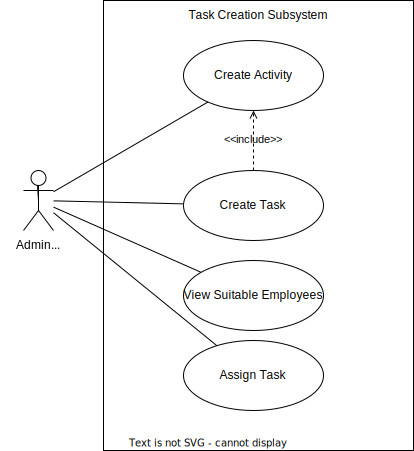

# Deliverable 4

## Team Name: Lambda++

## Team Number: 18

## Sponsor: EPI-USE

## Project title: EPI-USE Game Farm Manager

## Team Members

Gage Nott

Ariel Sischy

Kevin Kiyo

Abuzar Bulbulia

___

## Background

The Melorane Game Reserve (ERP, 2021) is a habitat for elephants and rhinos, located in the North West Province, that works in tandem with the nearby Barokologadi Community. The goals of the reserve are to create economic opportunities for the community and to serve as a nature reserve for the wildlife. ERP (Elephant, Rhinos and People) (ERP, 2022), the nonprofit organization in charge of this reserve, started this project in 2021 and has a 90-year lease, meaning this reserve is a long-term strategic project. ERP (working under GroupElephant.com (GroupElephant. 2023)) also plans to franchise this model for future conservation efforts.

Currently, the reserve typically handles fewer than 30 concurrent employees, but with a high likelihood of expansion. The employees usually work far apart, spread across the reserve, in small teams. They largely work on tasks such as maintenance of fencing and the dam, surveying of important foliage / fending off invasive plants, keeping track of animal populations, and so on. There is currently a single administrator who manages the daily activities.

### **Problem Statement**

It is difficult for the sole administrator to manage activities across the reserve. There is no formal system in place to assign activities to ERP employees and track progress, leading to miscommunication and disorganization. Furthermore, there is no system to track the various employees' skill sets and availability, resulting in scheduling conflicts and mismanaged skillsets when tasks are assigned. This leads to wasted time and effort to sort out these issues. Finally, there are no formal means to track and request stock and equipment for a task or for the administrator to manage these resources. This, again, leads to wasted time and effort due to conflicts over resources.

### **Proposed Solution**

We seek to develop a system that will enable the management of work activities and supplies. This will consist of an administrative site to create and monitor activities and stock, as well as a mobile application to allow employees to keep track of the activities they do and changes to the stock.
By the construction of the administrative site, it should be much easier for the administrator to manage the completed, in progress, and upcoming reserve activities and keep track of what is going on. The extensive reports the system generates should empower the administrator to make decisions based on up-to-date information and the monitored performance of employees.
The ability to track the stock and equipment will allow informed decisions to be made about what stock to buy, how to schedule the usage of limited equipment, and keep track of which tasks use certain resources and how much.
Another important feature is the automatic suggestion of the best employees for the task. This occurs during task creation and is based upon the relevant skills and availability of employees, which should allow for the right employees to be easily and quickly selected for the job.

The mobile application will enable employees to interact with this system on the go, as they are typically outdoors across the reserve. They will be able to keep track of what tasks they are assigned to, whom they are working with, the associated locations and deadlines, the status of the task and any updates that are made to it.
It will allow for clear and concise communication on the task's progress between task members themselves and with the administrator. It will also allow for formalised requests to be made to the administrator, for example for stock/equipment, or for extensions to the deadlines.
An administrative branch of the app will also be required as the administrator is often outside too. This will allow for them to be kept up to date on the status of the tasks and any requests made by employees.

___

## Use Case Diagrams

### Activity & Task Creation

### Task Management

#### User Management

#### Stock Management

#### Report Management

___

## Component & Deployment Diagram

___

## Comprehensive Verification & Validation Plan

## Validation

Are we building the right product?

### **Validity Tests**

In the upcoming months, our testing process for the Melorane Game Reserve's Employee and Task Management System will involve comprehensive Unit, Integration, System, and User Acceptance Testing. These tests have been designed to ensure that our system aligns with the specific requirements outlined in our design and effectively addresses the unique needs of the game reserve. To verify the expected functionality of our components across various testing categories, we will also employ verification tests as described in the Verification section of our testing strategy.

Unit Testing: During Unit Testing, we will carefully isolate and evaluate each individual component of the system to validate its expected behavior. This meticulous examination allows us to identify and rectify any architectural or operational errors that may exist within these components.

Integration Testing: Integration Testing will involve combining the different components of the system to assess how well they interact with one another. This phase aims to identify and address any potential failure points related to information transfer, as well as any version or dependency conflicts that may arise.

System Testing: The entire system will undergo comprehensive System Testing, where all components are integrated and subjected to thorough testing. This phase ensures that any remaining errors or bugs are uncovered and resolved prior to the system's market release, guaranteeing the proper functioning of all endpoints.

User Acceptance Testing: Melorane Game Reserve Engagement Testing holds great importance as we invite users and clients from the Melorane Game Reserve to participate in our User Acceptance Testing process. This collaborative engagement allows us to assess our system's performance and receive valuable feedback from the users and clients. By involving them in the testing phase, we can identify any remaining errors or unexplored endpoints, while gathering insights on the usability and accessibility of our system. The feedback received from the Melorane Game Reserve users and clients will play a crucial role in refining and enhancing our system further.

Through these rigorous testing procedures, we are committed to delivering a high-quality Employee and Task Management System for the Melorane Game Reserve. Our aim is to meet the specific requirements of the game reserve while providing an excellent user experience.

### **Completeness Checks**

During validation, it's important to verify the proper capture of required employee and task information. This includes validating employee names, contact details, task descriptions, and deadlines. The system should seamlessly incorporate necessary functionalities, such as accurate employee profile management and task assignment capabilities.

Data accuracy and retrievability are critical. Tests should confirm the system's ability to store and maintain employee and task records without loss or corruption. Retrieval mechanisms, like search and filtering, should provide quick and reliable access to necessary information.

Essential features must be thoroughly tested and validated. This includes ensuring notifications, reminders, and reporting capabilities function properly. Notifications should be timely and reach the intended recipients. Reminders should prompt employees and administrators about upcoming deadlines. Reporting capabilities should generate comprehensive reports on employee performance and task progress.

By conducting comprehensive tests, the Employee and Task Management System ensures accurate information capture, proper functionality, reliable data storage and retrieval, and successful implementation of critical features.

### **Consistency Checks**

Consistency checks are crucial in validating the Employee and Task Management System. They ensure data integrity and accurate task management.
Data format consistency is validated, including standardized date and time formats for tasks and employee information. This promotes accurate data handling and uniformity. Task dependencies and relationships are verified, confirming accurate task linking and reflection of dependencies.

Consistent application of employee roles and permissions is essential. The system should assign and maintain roles based on rules and organizational requirements, granting appropriate access. This ensures employees can perform tasks and access information without encountering unauthorized areas.

Furthermore, updates and changes to employee or task data must be reflected consistently. Modifications to profiles, task assignments, or other data should be accurately implemented and propagated throughout the system. This guarantees a unified and reliable view of up-to-date information.

By conducting consistency checks, the system enforces data format consistency, establishes and maintains task relationships, applies employee roles consistently, and ensures accurate data representation. This contributes to reliable data management and efficient task execution processes.

### **Realism Checks**

Realism checks are crucial in validating the Employee and Task Management System. They ensure that the system accurately represents the organizational structure and employee hierarchy at the Melorane Game Reserve.

This involves verifying that the system reflects the real reporting relationships and hierarchies within the reserve, capturing managerial positions and their subordinates accurately.

Additionally, task assignments and responsibilities need to align with employee roles and capabilities. Tests are conducted to ensure tasks are appropriately assigned based on job roles, skills, and expertise. This optimization of task distribution enhances productivity and efficiency.

Realism checks extend to notifications, reminders, and scheduling functionalities. Tests validate the realistic timing and urgency of notifications and reminders, meeting operational requirements. Scheduling functionalities accommodate reserve-specific needs for task planning and allocation.

User-friendliness and intuitiveness of the mobile app and administrative web app are also assessed. Interfaces should seamlessly cater to employees and administrators, reflecting real-world needs. Usability tests confirm design, navigation, and interaction patterns align with user expectations and workflows.

By conducting realism checks, the Employee and Task Management System accurately represents the organizational structure, aligns task assignments with employee roles, provides realistic notifications and scheduling, and offers user-friendly interfaces. This ensures optimal functionality and user satisfaction at the Melorane Game Reserve.

### **Ambiguity Checks**

Ambiguity checks are essential in validating the Employee and Task Management System. They aim to identify and eliminate any unclear or ambiguous information within the system. This involves reviewing the user interface, instructions, and labels to ensure clarity.

User testing and feedback gathering are vital in uncovering areas of confusion or ambiguity. By observing users interact with the system and gathering their input, valuable insights can be obtained to address and resolve any ambiguity issues.

Error messages and prompts should provide clear guidance to users when they encounter unexpected scenarios or errors. Clear communication and actionable instructions help users navigate through issues effectively.

The system documentation, including user manuals and help guides, should be comprehensive and unambiguous. It should address common user questions and scenarios, providing clear instructions for system usage.

By conducting ambiguity checks, reviewing the user interface and instructions, gathering user feedback, ensuring clear error messages, and validating the system documentation, the Employee and Task Management System ensures a clear and user-friendly experience. This fosters effective utilization of the system within the Melorane Game Reserve, minimizing misunderstandings and enhancing user satisfaction.

## Verification

### **Task Creation Subsystem**

| #                                                     | Test Name                                                                        | Input                | Conditions/Test                                                                                    | Expected Output |
|-------------------------------------------------------|----------------------------------------------------------------------------------|----------------------|----------------------------------------------------------------------------------------------------|-----------------|
| 1                                                     | Create Activity                                                                  | Activity Parameters. | Provide valid and complete activity details, such as title, description, start date, end date etc.Verify that all mandatory fields are properly filled. |       The system accepts the activity details and creates a new activity successfully.
| 2                                                 |   | Activity Parameters. | Provide incomplete activity details, leaving out one or more mandatory fields. | Display error message, “Mandatory fields missing.” The system prevents the creation of the activity.|
| 3                                                     | Create Task                                                                  | Task Parameters | Provide valid and complete task details, such as title, description, start date, end date etc.Verify that all mandatory fields are properly filled. |The system accepts the activity details and creates a new task successfully. | 
| 4                                             |   | Task Parameters | Provide incomplete activity details, leaving out one or more mandatory fields. | Display error message, “Mandatory fields missing.” The system prevents the creation of the task.|
| 5 | View Suitable employees | Skills required for specific task. | All employee skills viewed and evaluated for suitability. | Employee selected based on skill suitability. |
| 6 |   | Skills required for specific task. | Could not find suitable employee. | Error message displayed, “No suitable employee found”. |
| 7                                                    | Assign Task                                                                | Task Details and Employee Skillset. | Identify an employee to whom the task will be assigned.Verify that all mandatory fields are properly filled. |The system excepts details and assigns the task to the specified employee.|
| 8 |   | Task Details and Employee Skillset. | Employee unavailable due to other work. | Error message displayed “Could not add employee to task” and prevents the assignment of the task. |
| 9 |   | Task Details and Employee Skillset. | Providing incomplete or invalid details. | Error message displayed “Could not add employee to task” and prevents the assignment of the task. |

### **Task Management Subsystem**

| # | Test Name             | Input                          | Conditions/Test                 | Expected Output                          |
|---|-----------------------|--------------------------------|---------------------------------|------------------------------------------|
| 1 | Display Current Tasks | Navigate to current tasks tab. | Tasks are called from database. | List of current tasks displayed to user. |
| 2 |   | Navigate to current tasks tab. | No tasks received from the API. | Error message displayed, “Tasks could not be retrieved.” |
| 3 | Give Feedback on Task | Employee provides feedback on task. | Task exists, feedback details. | Feedback is received and successfully stored. |
| 4 |   | Employee provides feedback on task. | System unable to store feedback. | Error message displayed, “Unable to store feedback.” |
| 5 | Complete Task | Employee will mark task as complete. | Task is marked as complete. | The system updates tasks status to “Complete”. |
| 6 |   | Employee will mark task as complete. | Elements of task appear missing. | Error message displayed, “Couldn’t update task status.” |
| 7 | Request Extension | Extension Request, Task Identifier. | Provide valid extension request details. | Request granted; task due date is updated. |
| 8 |   | Extension Request, Task Identifier. | Invalid task identifier provided. | Error message displayed, “Task not found.” |
| 9 |   | Extension Request, Task Identifier | Provide empty extension request details. | Error message displayed, “Request details missing.” |
| 10 | Give Update on Task | Task Identifier | Provide valid task update details, such as progress status, additional comments, pictures or any relevant changes. | System accepts and stores task update successfully. |
| 11 |   | Task Identifier | Provide an invalid or non-existent task identifier. | The system displays an appropriate error message that the task was not found. |
| 12 |   | Task Identifier | Provide empty update details. | The system displays appropriate error message indicating that details are invalid or missing. |
| 13 | Request Removal from Task | Task Identifier, Employee Identifier | Provide valid reason to be removed from task.         | System updates task and removes employee.  |
| 14 |   | Task Identifier, Employee Identifier | Provides invalid/non-existent task ID or employee ID. | Error message displayed, “Could not find task/employee”. |
| 15 |   | Task Identifier, Employee Identifier | Provides empty removal request details. | Error message displayed, “Removal details missing.” |
| 16 | Rate User | Employee Identifier | Provide valid rating details, such as numeric ratings or qualitative feedback. | The system captures the rating and adds it to employees aggregate rating. |
| 17 |   | Employee Identifier | Provide invalid or non-existent employee identifier. | Error message displayed, “Could not find employee.” |
| 18 |   | Employee Identifier | Provide rating in incorrect format. | Error message displayed, “Incorrect rating format.” |
| 19 |   | Employee Identifier | Provide empty rating details. | Error message displayed, “Rating details missing.” |
| 20   | Remove Employee from Task                    | Employee Identifier,Task identifier  |Confirm the removal of the employee from the task.Verify that the removal action is initiated.   |The employee is removed from the task and the task is updated.
| 21              |                                                                         | Employee Identifier, Task identifier|Provide invalid or non-existent employee identifier or task identifier.identifier                         |Error message displayed, “Could not be found. 
| 22              |                                                              | Employee Identifier,  Task identifier                                    |Provide employee reference that is not assigned to the task. |Error message displayed, “Employee not included is task.” |

### **User Management Subsystem**

| # | Test Name         | Input           | Conditions/Test                                                                        | Expected Output                                                  |
|---|-------------------|-----------------|----------------------------------------------------------------------------------------|------------------------------------------------------------------|
| 1 | Edit User Details | User Identifier | Provide valid updated user details, such as name, email, or any other editable fields. | The system accepts and stores updated user details successfully. |
| 2 |   | User Identifier | Provides invalid user identifier. | Error message displayed, “User not found.” |
| 3 |   | User Identifier | Provides updated details in incorrect format. | Error message displayed, “Incorrect format” |
| 4 | Upload Documents | Document File | Select valid file to upload. Make sure that selected file meets any specified file format, size or other requirements. | The system accepts and uploads the document successfully. |
| 5 |   | Document File | Attempt to upload in an invalid or unsupported document file format. | Error message displayed, “Unsupported file format.” |
| 6 |   | Document File | Attempt to upload an empty document.” | Error message displayed, “Could not upload.” |
| 7                                              | Register User                                              | Name, Surname, Email, ID Number, Password | Provide valid registration details.Ensure details adhere to any specified format. | The system successfully registers and stores the new user. |
| 8 |   | Name, Surname, Email, ID Number, Password | Attempt to register a user with an email address already in the system. | Error message displayed, “Email address in use.” |
| 9 |   | Name, Surname, Email, ID Number, Password | Provide incomplete registration details. | Error message displayed, “Fill in empty fields.” |
| 10 |   | Name, Surname, Email, ID Number, Password | User attempts to create password with less than 6-characters. | Error message displayed “Password must be at least 6 characters long.” |
| 11 | Delete Employee | Employee Identifier | Confirm the deletion of the employee, verify that the deletion action is initiated. | The system successfully deletes employee. |
| 12 |   | Employee Identifier | Provide an invalid or non-existent employee identifier. | Error message displayed, “Employee not found.” |

### **Stock Management Subsystem**

| #                                                                          | Test Name                                           | Input                 | Conditions/Test                                              | Expected Output |
|----------------------------------------------------------------------------|-----------------------------------------------------|-----------------------|--------------------------------------------------------------|-----------------|
| 1                                                                          | Modify Stock                                        | Stock Item Identifier | Provide the quantity to add or subtract form the stock item. Verify that the quantity modification adheres to any rules or constraints. |    The system successfully updates the stock quantity.   |
| 2 |   | Stock Item Identifier | Provide in an invalid or non-existent stock item identifier. | Error message displayed, “Stock item not found.” |
| 3 |   | Stock Item Identifier | Provide an empty quantity modification. | Error message displayed. “Could not save changes.” |
| 4 | Use Stock | Stock Item Identifier | Provide the quantity of stock to use. | The system deducts the specified quantity from the stock successfully. |
| 5 |   | Stock Item Identifier | Attempt to use a quantity of stock that exceeds the available stock quantity. | Error message displayed, “Request exceeds available stock.” |
| 6 |   | Stock Item Identifier | Provide an empty quantity to use. | Error message displayed, “Could not process request. |
| 7 | Request Stock | Stock Item Identifier | Provide the quantity of stock to request. | The system records the requested quantity successfully. |
| 8 |   | Stock Item Identifier | Invalid stock item identifier. | Error message displayed, “Could not find requested item.” |
| 9 |   | Stock Item Identifier | Provide an empty requested quantity. | Error message displayed, “Could not process request.” |
| 10 | Check For Low Stock | Threshold Quantity, Stock Item Identifier. | Set the quantity below the specific threshold. | The system identifies the stock quantity as low and triggers appropriate actions or notifications. |
| 11 |   | Threshold Quantity, Stock Item Identifier. | Set the quantity above the specified threshold. | The system recognizes the stock quantity is not low and does not trigger any low stock actions or notifications. |

### **Report Subsystem**

| # | Test Name            | Input           | Conditions/Test                                                                             | Expected Output                                                                |
|---|----------------------|-----------------|---------------------------------------------------------------------------------------------|--------------------------------------------------------------------------------|
| 1 | Generate Task Report | Report Criteria | Specify the criteria for generating the task report, date, task status, assigned users etc. | The system accepts the report criteria successfully and a report is generated. |
| 2 |   | Report Criteria | Provide invalidated or unsupported criteria. | Error message displayed, “Could not generate report." |
| 3 | Generate User Report | Report Criteria | Specify the criteria for generating the user report, such as user role, department, employment status etc. | The system accepts the report criteria successfully and a report is generated. |
| 4 |   | Report Criteria | Provide invalidated or unsupported criteria. | Error message displayed, “Could not generate report." |
| 5 | Generate Stock Report | Report Criteria | Specify the criteria for generating the stock report, such as stock item category, supplier, quantity range etc. | The system accepts the report criteria successfully and a report is generated. |
| 6 |   | Report Criteria | Provide invalidated or unsupported criteria. | Error message displayed, “Could not generate report." |

___

## Gantt Chart & Resource Breakdown

See Gantt Chart attached at the end of the document.

### Total Cost Estimate

There are many potential benefits from this solution, such as increased productivity, reduced errors, and better resource management. By increasing the productivity of the administrator and employees, we will avoid needing to hire new staff to cover inefficiencies. 

The salary for an administrative position is R25 000 a month, or R300 000 annually. 

The reserve equipment and stock are very expensive, and either overbuying, or misplacing such creates a considerable cost. The annual fencing costs are around 5% of the setup costs - averaging maintenance and expansion costs – so are roughly R10 000 (WildlifeCampus, 2019). The other miscellaneous stock costs - maintenance of buildings, and the dam, animal feed, etc. – are at a similar level: around R20 000 a month.
Assuming average stock costs of 30 000 per month, if an average of 7% of that is wasted due to overbuying stock/misplacing, we end up with annual wastage of around R25k (30 000*0.07*12 = R25 200).

As the reserve’s activities grow over the years, and especially considering that there are plans to franchise this preservation model and create other reserves like this one, such stock usage may easily double or triple. It is tricky to forecast this growth as these are still early days in the existence of the reserve. We estimate around 5-10% annual expansion. When dealing with wildlife, a stable population of animals can experience an exponential growth in their population (WildlifeCampus, 2019). If this were to occur for the animals on the reserve, we may see these operational costs increase even further.
By developing this system, we expect to see a marked improvement in the amount of stock wastage, which should allow for the reserve to handle any future growth without unnecessary wasteful expenditure.

To estimate the development costs of the system, the following information must be considered: Assuming a team of 4 junior developers working at a salary of R20 000 per month (10) for the 8-month development cycle we are limited to, the total cost of salaries would be R640 000. Initially, no equipment such as phones or desktop PCs will need to be provided to the workers as this infrastructure already exists. It would likely not be necessary to spend funds to improve the internet connectivity at the reserve. Currently, communication is done via WhatsApp, including the sending of images as proof that tasks are complete. The new system would not be very different in terms of data usage and file transfer size, and thus the existing infrastructure should be plenty for initial implementation.

It is important to note that EPI-USE has the existing infrastructure and internal developers on hand whom they will rely on for upkeep and support of the system.
As for the near future there will typically only be 10 simultaneous users of the system, peaking at around 30 at worst, a large, dedicated server setup is not needed. A normal desktop computer would be able to run the server software and API without issue. This cost will come at R6 000, and will need to be replaced every 5 years.

No software expenditure should be required apart from the in-house development costs outlined above. The R6000 hardware expense for an average desktop computer would likely include a Microsoft Windows licence, but Linux could also be used as the server's operating system, as a free alternative.

Assuming the developers remain on hand for two weeks to deploy the system and handle any issues that occur during this time, we can add (20 000/2 * 4) = R40 000 to the deployment costs.

Total Cost: 
Initial Development and deployment costs: R640 000 + R40 000 = R680 000. 
Hardware costs: R6 000 per 5 years. 
Year 1: 680 000 + 6 000 = R686 000. 
Year 6: 686 000 + 6 000 = R692 000. 

Cost Savings:  
Although these are hard to predict, we estimate the system may avert the need to hire an additional administrator in the short term, and another every 2 years.
Thus we consider their annual salary of R300 000 to be a cost saving. 
Assuming the new system is able to almost completely reduce stock wastage costs of R25 200, increasing with the 5% growth of the reserve, we have the following savings: 
Year 1: 300 000 + 25 200 = 325 200 
Year 2: 325 200+ 25 200*1.05 = 351 660 
Year 3: 351 660 + 25 200*1.05^2  + 300 000  = 679 443 
Year 4: 679 443+ 25 200*1.05^3 = 708 615  
Year 5: 708 615 + 25 200*1.05^4   + 300 000 =  1 039 245  
Year 6:  1 039 245+ 25 200*1.05^5  = 1 071 407  

As we can see, the savings will have eclipsed the development costs at year 3, and start saving money from there on out.
Although this is just a rough estimate, it proves the financial viability of the system.

___

## References

1. ERP. (2021, 12 21). ERP Melorane Game Reserve. Retrieved from ERP: https://www.erp.ngo/updates/2021/12/21/erp-melorane-game-reserve
1. ERP. (2022). ERP. Retrieved from ERP: https://www.erp.ngo/
1. GroupElephant. (2023). GroupElephant. Retrieved from GroupElephant: https://www.groupelephant.com/
1. PayScale. (2023, Mar 30). Average Junior Software Engineer Salary in South Africa. Retrieved from PayScale: https://www.payscale.com/research/ZA/Job=Junior_Software_Engineer/Salary
1. WildlifeCampus. (2019). WildlifeCampus Game Ranch Economics Course. Retrieved from WildlifeCampus: https://www.wildlifecampus.com/Courses/GameRanchEconomics/GameRanchEconomics/UpfrontCostofGameRanching/892.pdf
