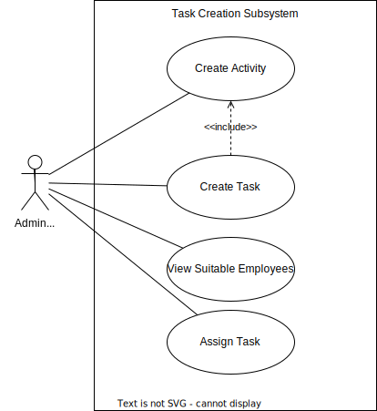
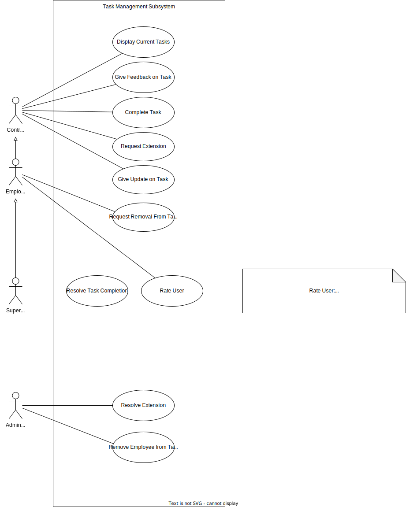
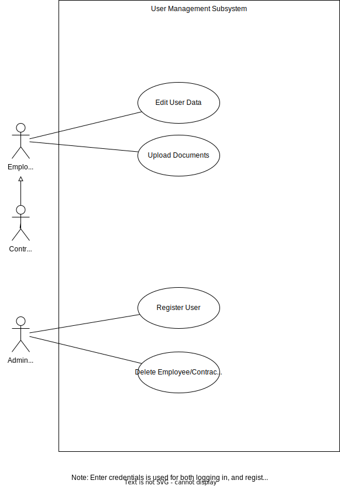
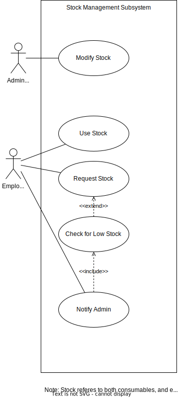

# Deliverable 4

## Team Name: Lambda++

## Team Number: 18

## Sponsor: EPI-USE

## Project title: EPI-USE Game Farm Manager

## Team Members

Gage Nott

Ariel Sischy

Kevin Kiyo

Abuzar Bulbulia

___

## Background

The Melorane Game Reserve (ERP, 2021) is a habitat for elephants and rhinos, located in the North West Province, that works in tandem with the nearby Barokologadi Community. The goals of the reserve are to create economic opportunities for the community and to serve as a nature reserve for the wildlife. ERP (Elephant, Rhinos and People) (ERP, 2022), the nonprofit organization in charge of this reserve, started this project in 2021 and has a 90-year lease, meaning this reserve is a long-term strategic project. ERP (working under GroupElephant.com (GroupElephant. 2023)) also plans to franchise this model for future conservation efforts.

Currently, the reserve typically handles fewer than 30 concurrent employees, but with a high likelihood of expansion. The employees usually work far apart, spread across the reserve, in small teams. They largely work on tasks such as maintenance of fencing and the dam, surveying of important foliage / fending off invasive plants, keeping track of animal populations, and so on. There is currently a single administrator who manages the daily activities.

### Systems Systems Currently In Place

The Melorane Game Reserve has been operating with a relatively primitive set of systems for quite some time. While the reserve has been successful in its efforts to protect the wildlife and preserve the natural habitat, the current processes for task allocation and tracking, administrative decision-making, and data collection are all manual, relying on Microsoft Excel spreadsheets and Word documents. This makes it a tedious and time-consuming process to manage resources, stock, and equipment effectively.
Meanwhile, communication on which tasks must be done, what equipment is being used, whether tasks have been completed successfully etc. are all done via WhatsApp on an ad-hoc basis.
In other words, the organisation is currently running at an informal, Level 1 basis on the Levels of Capacity Maturity Model ([1]), meaning processes are not clearly defined or repeatable.

Moreover, with rapid advancements in technology, there is growing concern that the current systems might not be sufficient for the changing needs of the reserve. For instance, the lack of automation in data collection limits the staff's ability to collect, process, and analyse critical information, hindering the overall success of their conservation efforts.

The Melorane Game Reserve needs to adapt to the changing needs of the conservation industry and invest in more advanced and efficient systems. This would enable them to track and manage their resources more effectively, reduce manual errors, and improve their overall efficiency. By implementing modern technology, they would be able to keep pace with the ever-evolving conservation landscape and continue to make a positive impact on the environment. Our goal is to make this transformation possible through the system we plan on developing, which will automate the aforementioned tasks and activities.

### **Problem Statement**

It is difficult for the sole administrator to manage activities across the reserve. There is no formal system in place to assign activities to ERP employees and track progress, leading to miscommunication and disorganization. Furthermore, there is no system to track the various employees' skill sets and availability, resulting in scheduling conflicts and mismanaged skillsets when tasks are assigned. This leads to wasted time and effort to sort out these issues. Finally, there are no formal means to track and request stock and equipment for a task or for the administrator to manage these resources. This, again, leads to wasted time and effort due to conflicts over resources.

### **Proposed Solution**

We seek to develop a system that will enable the management of work activities and supplies. This will consist of an administrative site to create and monitor activities and stock, as well as a mobile application to allow employees to keep track of the activities they do and changes to the stock.
By the construction of the administrative site, it should be much easier for the administrator to manage the completed, in progress, and upcoming reserve activities and keep track of what is going on. The extensive reports the system generates should empower the administrator to make decisions based on up-to-date information and the monitored performance of employees.
The ability to track the stock and equipment will allow informed decisions to be made about what stock to buy, how to schedule the usage of limited equipment, and keep track of which tasks use certain resources and how much.
Another important feature is the automatic suggestion of the best employees for the task. This occurs during task creation and is based upon the relevant skills and availability of employees, which should allow for the right employees to be easily and quickly selected for the job.

The mobile application will enable employees to interact with this system on the go, as they are typically outdoors across the reserve. They will be able to keep track of what tasks they are assigned to, whom they are working with, the associated locations and deadlines, the status of the task and any updates that are made to it.
It will allow for clear and concise communication on the task's progress between task members themselves and with the administrator. It will also allow for formalised requests to be made to the administrator, for example for stock/equipment, or for extensions to the deadlines.
An administrative branch of the app will also be required as the administrator is often outside too. This will allow for them to be kept up to date on the status of the tasks and any requests made by employees.

___

## Requirements Extraction

### **Functional Requirements**

1. The system must contain a database with a list of existing activities that need to be completed, in addition the database should contain information regarding the skills of the employees.
2. The administrator of the system must be able to add employees into the system via registration links.
3. The employees must be able to upload documents and information about themselves, and update their information at any time.
4. The administrator of the system must be able to create new activities and sub-tasks inside the activities, and must stipulate further specificities regarding the given activity.
5. The administrator must have the ability to populate the skills needed for each activity in the database, by selecting from the existing skills available, they should also have the option to add new skills should this become a requirement.
6. The administrator must be able to view a timeline of upcoming activities and tasks, as well as view employee availability schedules.
7. The administrator must be able to assign certain ERP employees to certain tasks, and optionally set an employee as the supervisor of the task.
8. When the administrator is assigning employees, the system should suggest the best employees for the task based on their skills, rating and availability.
9. If no suitable employee is available for a certain task, an external contractor can be assigned to the task.
10. Each employee must have access to the mobile application, where they will be able to see the activities and tasks assigned to them as well as the timeframe for the tasks.
11. The employee will be notified if they are assigned to a task, and must respond to the notification by either accepting or declining the request with a comment.
    - If the employee accepts the request, then the app must automatically add this task to their calendar.
    - If the employee declines the request, the app should notify the administrator of the declination and should suggest other suitable employees that can be assigned.
    The employee will also be able to suggest a suitable replacement - either another employee or an external contractor.
12. Employees must be able to specify the equipment and stock needed to fulfil the task that they have accepted.
13. The equipment and tools list should be a prepopulated database table of existing items, tracking their relevant details. If the item is not available then the item can be requested by an employee and the administrator will receive a notification.
14. The app should have functionality to track the stock, equipment and tools that are kept in the warehouse.
    - When a consumable product such as paint or wood is taken from the warehouse, the employee must indicate this on the app so that the system count can automatically update.
    - If stock levels are low for any given item on the system, the administrator should receive a notification.
15. The employees must be able to request an extension on a given deadline if the need arises, it will be the job of the administrator to assess the outcome of the request.
16. The employees must be able to mark tasks as complete and give feedback, provide evidence or comment on the task's completion.
17. The administrator or the supervisor of the task can sign off on the completion of the task and rate the employees' performance.
18. The administrator should have access to dashboards with relevant statistics regarding the employees, tasks, skills, performance and stock as well as be able to extract customisable reports on these.

### **Non-Functional Requirements**

**Security**: The system should be secure such that only authorised users will obtain access to the app as confidential information is stored therein. Certain users *(such as administrators)* will have access to more functionality due to their role. To achieve this, the system will make use of an encryption protocol, such as TLS *(Transport Layer Security)* when storing and retrieving data from the database. For logical access, the use of passwords, biometrics and perhaps even multi-factor authentication will also be used to ensure the highest levels of security. The system should ideally meet the requirements of *ISO 27001* ([2]), which is an international standard for information security.

**Reliability**: The system should perform what is required at any given time. Furthermore, all data generated by the system should be accurate and correct. The system should have a 99% reliability rate, meaning that under normal usage conditions, there's a 99% chance that the system won’t experience any glitches, crashes or even critical failure. To achieve this, the system will make use of internal hosting because, at most, only 10 people will be using the system at any given time and the company has onsite expertise to manage the hosting. Thus, the reliability of the system can be guranteed since most aspects of the system are controlled by the company. The system should ideally meet the *IEEE Standard for Software Reliability* ([3]), which outlines guidelines for implementing and testing reliability in information systems.

**Usability**: The system should be ergonomic and intuitive. A minimal number of clicks should be needed to perform most actions. A good metric for the number of clicks to create a new task in the average project management system is 3-4 clicks. The updating and completion of tasks will take at most another 3-4 clicks *(outside of typing, taking pictures etc.)*. The system should have a simple and easy-to-use interface, make use of a good light theme *(as the app is likely to be used outdoors most of the time)*, quick authentication and a response time of under 1s *(provided there is good internet coverage on the reserve)*. The system should ideally meet the requirements of *ISO 9241* ([4]), which is an international standard that provides guidelines for designing user-friendly interfaces.

___

## Feasibility Study

### **System Feasibility**

The core of our program is a project management tool. While there are many options available on the market, such as Monday.com, Wrike, Slack, and even Microsoft Teams and Github ([5]), our system will be designed specifically for field workers. It must be simple and quick for employees to update their tasks on the go using a mobile application.

Additionally, the system must have built-in functionality for tracking stock and equipment usage to mitigate conflicts regarding multiple teams requiring the same equipment simultaneously.
Although systems such as UpKeep and Monday.com ([6]) have stock management functionality, they may include unnecessary features that make them slower for employees to learn and harder to use in the field.

Finally, as Melorane Game Reserve is an ERP's "Flagship Project" ([7]) a custom-built and internally-owned system would be preferable to licensing third-party software as it allows for future extensions and modifications of the system to suit their purposes and plans for expansion.

At the moment, task allocation, admin-decision-making and equipment management are all done manually via Microsoft Word and Excel. Team communication and reporting of tasks are done via WhatsApp. It is clear that this system should be replaced as this lacks tracking/recording capabilities, reporting capabilities, etc. As well as being very manual, which leaves much room for user error. It is clear this ad-hoc system must be replaced by something more formal.

Considering these factors, the development of the system is recommended over the use of alternatives and is definitely an improvement over the currently implemented systems.

### **Technical Feasibility**

#### ***Hardware***

Workers will primarily interact with the system through handheld devices as they are the most portable and already carried around by the workers, minimising changes to their daily routine. This portability is important as the workers will likely interact with the system multiple times throughout the day, as they accept or complete tasks, etc.
We are limiting our mobile application to run on Android devices for now, as the workers primarily use Android devices. It may be wise to create a version for iOS in the future, but this is not important functionality for the initial version of the system.
Initially, the workers are likely to use their own private devices. Due to this, the devices may have storage space and processing power limitations. The software must therefore avoid being too processing intensive and must not take up too much storage space. This should not be a problem as the bulk of data storage will take place in the database, not on the client device, and most processing and logic will be done on the API.

Only the administrator primarily works on a desktop, however they are often also in the field throughout the day.

Server hosting will be required as all workers and the administrator will access and update the same data from the database and will make use of the same API functionality. Servers may be hosted externally via a third party using cloud computing or renting a rack, or they may be managed internally. Both have advantages and disadvantages, however after review, internal hosting seems to be the ideal solution. This is because the system can then operate even if the internet connection is down, because it can operate via the internal network of the reserve. This reliability is important as it is one of our key non-functional requirements.
The server hardware need not be expensive or advanced. As there will only ever be around 10 simultaneous users of the system, a dedicated server setup is not needed. A normal desktop computer would be able to run the server software and API without issue.

#### ***Software***

Workers will require a mobile application to be able to work portably. As most workers use Android devices, our initial version of the system will be on Android. Supervisors will make use of the same software as workers, with a few additional functions such as rating other employees based on their performance.
For the administrator, we will create a web application for their administrative functionality, such as assigning tasks, and managing employees and stock. As the administrator has more functionality available and serves a more active role than the other employees, a web application is the most sensible solution.
It allows for a more complex interface than a mobile application and allows for easier complex interactions.
A web application is preferable to a desktop application as it:

Allows for the administrator to work off any desktop without having to download software.
Requires internet access, which is essential for API access.
As they are often out in the field, it is important that they do have some mobile capabilities, for everyday tasks such as viewing the statuses of tasks being completed.

### **Economic Feasibility**

Melorane Game Reserve is an ERP project funded through a portion of the revenue of GroupElephant ([8]), ERP's parent company. ERP seeks to be "run with the discipline of a business" ([9]) and supports new systems to pursue potential solutions to the problems they encounter.

To estimate the development costs of the system, the following information must be considered:
Assuming a team of 4 junior developers working at a salary of R20 000 per month ([10]) for the 8-month development cycle we are limited to, the total cost of salaries would be R640 000.
Initially, no equipment such as phones or desktop PCs will need to be provided to the workers as this infrastructure already exists.
It would likely not be necessary to spend funds to improve the internet connectivity at the reserve. Currently, communication is done via WhatsApp, including the sending of images as proof that tasks are complete. The new system would not be very different in terms of data usage and file transfer size, and thus the existing infrastructure should be plenty for initial implementation.

With regards to long-term support costs, a more thorough breakdown will be included in later deliverables.
However, it is important to note that EPI-USE has the existing infrastructure and internal developers on hand whom they will rely on for upkeep and support of the system.
It is clear that EPI-USE is in a position where they are able to afford the development and maintenance costs of the system, if they choose for it to be developed and implemented.

### **Operational Feasibility**

For most employees using the system, interaction will be straightforward. Employees will typically accept tasks, take note of the equipment they are using, and record the progress and completion of the tasks. Basic training may be required, but no advanced knowledge is necessary. Making the usage of the app quick and simple is a core design goal, resulting in the system being easy to learn.
In all likelihood, less than 2 hours of walkthrough will be required for users to make use of the system. The administrator will have more complex functionality and will need to be shown how to use the software. A manual to refer to whenever guidance is needed would be wise until the administrator is fully comfortable with the system. The administrator is already familiar with the workings of the business, so no formal training would be required apart from this.
Measures will be implemented to ensure that the equipment records match reality, and that the employee's information and skills recorded in the database are accurate.
The project managers believe that this system will make a real difference to the day-to-day operations of the reserve. Currently, the best employees for the job aren't always assigned to the right jobs, and they believe this system will change that.

In conclusion, it seems the system will be practical for the users to learn to use, and will be worth implementing to make a positive change in the daily activities of the employees involved in the process.

____

## Use Case Diagrams and Descriptions

### Use Case Diagram: Activity & Task Creation

### Use Case: View Suitable Employees

**Input**
-  Set of skills required for the task.

**Output**
- Specific user(s) recommended for the task.

**Process**
1. The administrator enters the required skills needed to complete a task.
1. The system recommends suitable users (employees, contractors, supervisors) for the task (based on their rating, relevant skills, skill level and availability).

### Use Case: Assign Task

**Input**
- User(s) selected. 

**Output**
- User(s) will be assigned to the task. 

**Process**
1. The administrator will view and select suitable user(s) for the task. 
1. The system will notify the user of the task.
1. The system adds the user to the task and notifies the administrator.

### Use Case: Create Activity

**Input**
- Parameters of activity. 

**Output**
- Newly created activity.

**Process**

1. The administrator enters the parameters of the activity (name and description).
1. The system creates the activity.

### Use Case: Create Task

**Input**
- Parameters of task. 

**Output**
- Newly created task.

**Process**
1. The administrator enters the parameters of the task (name, activity, skills, dates and description).
1. The administrator assigns the task to suitable users.

### Use Case Diagram: Task Management

### Use Case: Display Current Task(s)

**Input**
- User details.

**Output**
- Current task(s) to be completed is displayed.

**Process**
1. User log on to the app using their credentials.
1. Click on the current task(s) allocated to the user. 
1. System displays status of current task(s) (assigned, in progress, completed). 

### Use Case: Give Update On Task

**Input**
- Update details.

**Output**
- Update is given regarding the task. 

**Process**
1. User selects a allocated task. 
1. The user provides an update on the task (Description, status, photo, location [all are optional]).
1. The system updates the task’s timeline.

### Use Case: Request Removal from task

**Input**
- Reason for removal from task.

**Output**
- Administrator will either accept ot reject removal request.

**Process**
1. The user selects removal from task status update.
1. The system sends a notification to the administrator of request.
1. The administrator accepts the request.
1. The system removes the user from the task.

**Extensions**

2a. Administrator rejects request
1. System notifies user of rejection.

### Use Case: Request Extension

**Input**
-Reason for extension.

**Output**
- A notification requesting an extension is sent to the administrator.

**Process**
1. The user enters their reasoning for why they need an extension.
1. The system sends a notification to the administrator requesting an extension of the deadline for the task. 

### Use Case: Resolve Extension

**Input**
-  

**Output**
- Extension request resolution.

**Process**
1. The system displays the extension request to the administrator.
1. The administrator accepts the extension.
1. The system notifies the user of acceptance.

**Extensions**

2a. Administrator rejects request
1. System notifies user of rejection.

### Use Case: Rate Employee

**Input**
- The employees rating for the user. 

**Output**
- Updated user rating.

**Process**
1. The supervisor signs off on a task.
1. The other employees that were assigned to the task rate the user based on their contribution to the completion of the task.
1. The rating includes feedback on what the user did well, and what they can improve on. (As an employee will not be able to see their given rating for a task, only feedback).

### Use Case: Remove Employee From Task

**Input**
- 

**Output**
- New task employee team.

**Process**
1. The user requests to be removed from the task due to some reason.
1. The administrator reviews the request.
1. The administrator accepts the request.
1. The user is removed from the task.
1. The user is notified.
1. The system is updated and the user is no longer listed is being part of the task.

### Use Case: Give Feedback On Task

**Input**
- Employee feedback on task.

**Output**
- Task feedback update.

**Process**
1. Administrator assigns employee to a task.
1. Employee completes task.
1. Employee must provide administrator with feedback regrading the task(status of task, obstacles and challenges, future advice etc).

### Use Case: Complete Task

**Input**
- The employee provides evidence that the accepted task has been completed.

**Output**
- Task completion notifications.

**Process**
1. The system notifies all employees about a task that has been assigned to them. 
1. The employee periodically provides updates on their progress, and is able to request additional stock.
1. Once the task is finished, the employee or supervisor marks the task as done.
1. The employee provides evidence that the task has been completed (pictures and/or text). 
1. The supervisor views the evidence, and marks the work as complete or incomplete.
1. THe system notifies all users on task that task is complete.

#### Use Case Diagram: User Management

### Use Case: Enter Credentials

**Input**
-  User enters credentials.

**Output**
-  Log in message.

**Process**
1. The user enters their registration credentials (Name, surname, ID number, password).
1. The system verifies details entered.
1. The system logs the user in.

**Extensions**

2a. Users will enter details in incorrect format.
1. Error message will be displayed.
1. Users will be prompted to re-enter incorrect field(s).

### Use Case: Upload Documents

**Input**
- Documents.

**Output**
-

**Process**

1. The user clicks on “Upload”.
1. The user browses devices for documents to upload.
1. The user selects relevant documents (ID, certificates, CV/Passport).
1. The user presses open to attach documents.
1. The user uploads documents.
1. The system stores documents.

**Extensions**

3a. No document was selected.
1. Error message will be displayed.
1. Users will re-select documents.

### Use Case: Register User

**Input**
-  User credentials.

**Output**
-  

**Process**
1. The administrator will enter the user’s email address.
1. The system will send a registration link to the email address.
1. The new employee (user) will open the registration link, redirecting them to the registration page.
1. The user will enter the necessary credentials (registration info, such as the username and password they will use).
1. The system will notify the administrator of the successful registration.
1. The system will add the user as an employee or contractor.

**Extensions**

4a. Details entered are incorrect.

1. Error message will be displayed.
1. Users will be prompted to re-enter details.

### Use Case: Edit User Details

**Input**
-  User details.

**Output**
-   

**Process**
1. The user clicks on the profile.
1. The system retrieves the user's details.
1. The user clicks on edit profile.
1. The user alters their details and/or uploads additional documents (i.e. certificates).
1. The user clicks on save changes.

**Extensions**

3a.  Changes could not be saved.

1. Error message will be displayed informing the user that changes have not been saved.

### Use Case: Delete Employee/Contractor

**Input**
-  User details. 

**Output**
-  

**Process**

1. The administrator searches for a specific employee/contractor.
1. The system retrieves the users information.
1. The administrator clicks “Delete User".
1. The system marks the user as deleted in DB.

**Extensions**

4a.  Changes could not be saved.

1. Error message will be displayed informing the user that changes have not been saved.

#### Stock Management

### Use Case: Modify Stock

**Input**
- New stock.

**Output**
- 

**Process**
1. The administrator goes to “Add Stock”.
1. The administrator inputs newly acquired stock to the system.
1. The system modifies stock levels.
1. The system notifies the administator regarding the status of the new stock input.

**Extensions**

2a.  The system will reject the new stock level.

1. Error message will be displayed.
1. Administrator must re-enter new stock items.

### Use Case: Use Stock

**Input**
- New stock level

**Output**
-

**Process**
1. The user inputs stock used.
1. The system notifies the administrator about the stock being used.
1. The administrator makes the relevant changes to the stock level(s).
1. The system stores the new stock levels.

**Extensions**

2a.  The system rejects the used stock.

1. Error message will be displayed.
1. Administrator must re-enter used stock items.

### Use Case: Request Stock

**Input**
- Stock item and quantity

**Output** 
-  

**Process**
1. The user requests stock for a task.
1. The system will notify the administrator of the request.
1. The administrator accepts the request.
1. The system will notify the user of the request result.
1. The system will update stock levels
1. The system will update the task resources and status.

**Extensions**

2a.  The administrator rejects the stock request

1. The system will update the task status.

___

## Activity Diagrams

### Activity Diagrams for Task Creation Use Cases

#### **Create Activity**

#### **Create Task**

### Activity Diagrams for Task Management Use Cases

#### **Remove User from Task**

#### **Rate User**

#### **Complete Task**

### Activity Diagrams for User Management Use Cases

#### **Log In**

#### **Register User**

#### **Edit User Profile**

#### **Delete User**

### Activity Diagrams for Stock Management Use Cases

#### **Add Stock**

#### **Use Stock**

#### **Request Stock**

___

## Database Design

___

## Component & Deployment Diagram

___

___

## Class Diagrams

### Overview and relationships

### Models

### API

### Android

### Web Application

___
## Interaction Sequence Diagrams

### Activity & Task Creation

---

---

### Task Management

---

#### User Management

#### Stock Management

____

## Comprehensive Verification & Validation Plan

## Validation

Are we building the right product?

### **Validity Tests**

In the upcoming months, our testing process for the Melorane Game Reserve's Employee and Task Management System will involve comprehensive Unit, Integration, System, and User Acceptance Testing. These tests have been designed to ensure that our system aligns with the specific requirements outlined in our design and effectively addresses the unique needs of the game reserve. To verify the expected functionality of our components across various testing categories, we will also employ verification tests as described in the Verification section of our testing strategy.

Unit Testing: During Unit Testing, we will carefully isolate and evaluate each individual component of the system to validate its expected behavior. This meticulous examination allows us to identify and rectify any architectural or operational errors that may exist within these components.

Integration Testing: Integration Testing will involve combining the different components of the system to assess how well they interact with one another. This phase aims to identify and address any potential failure points related to information transfer, as well as any version or dependency conflicts that may arise.

System Testing: The entire system will undergo comprehensive System Testing, where all components are integrated and subjected to thorough testing. This phase ensures that any remaining errors or bugs are uncovered and resolved prior to the system's market release, guaranteeing the proper functioning of all endpoints.

User Acceptance Testing: Melorane Game Reserve Engagement Testing holds great importance as we invite users and clients from the Melorane Game Reserve to participate in our User Acceptance Testing process. This collaborative engagement allows us to assess our system's performance and receive valuable feedback from the users and clients. By involving them in the testing phase, we can identify any remaining errors or unexplored endpoints, while gathering insights on the usability and accessibility of our system. The feedback received from the Melorane Game Reserve users and clients will play a crucial role in refining and enhancing our system further.

Through these rigorous testing procedures, we are committed to delivering a high-quality Employee and Task Management System for the Melorane Game Reserve. Our aim is to meet the specific requirements of the game reserve while providing an excellent user experience.

### **Completeness Checks**

During validation, it's important to verify the proper capture of required employee and task information. This includes validating employee names, contact details, task descriptions, and deadlines. The system should seamlessly incorporate necessary functionalities, such as accurate employee profile management and task assignment capabilities.

Data accuracy and retrievability are critical. Tests should confirm the system's ability to store and maintain employee and task records without loss or corruption. Retrieval mechanisms, like search and filtering, should provide quick and reliable access to necessary information.

Essential features must be thoroughly tested and validated. This includes ensuring notifications, reminders, and reporting capabilities function properly. Notifications should be timely and reach the intended recipients. Reminders should prompt employees and administrators about upcoming deadlines. Reporting capabilities should generate comprehensive reports on employee performance and task progress.

By conducting comprehensive tests, the Employee and Task Management System ensures accurate information capture, proper functionality, reliable data storage and retrieval, and successful implementation of critical features.

### **Consistency Checks**

Consistency checks are crucial in validating the Employee and Task Management System. They ensure data integrity and accurate task management.
Data format consistency is validated, including standardized date and time formats for tasks and employee information. This promotes accurate data handling and uniformity. Task dependencies and relationships are verified, confirming accurate task linking and reflection of dependencies.

Consistent application of employee roles and permissions is essential. The system should assign and maintain roles based on rules and organizational requirements, granting appropriate access. This ensures employees can perform tasks and access information without encountering unauthorized areas.

Furthermore, updates and changes to employee or task data must be reflected consistently. Modifications to profiles, task assignments, or other data should be accurately implemented and propagated throughout the system. This guarantees a unified and reliable view of up-to-date information.

By conducting consistency checks, the system enforces data format consistency, establishes and maintains task relationships, applies employee roles consistently, and ensures accurate data representation. This contributes to reliable data management and efficient task execution processes.

### **Realism Checks**

Realism checks are crucial in validating the Employee and Task Management System. They ensure that the system accurately represents the organizational structure and employee hierarchy at the Melorane Game Reserve.

This involves verifying that the system reflects the real reporting relationships and hierarchies within the reserve, capturing managerial positions and their subordinates accurately.

Additionally, task assignments and responsibilities need to align with employee roles and capabilities. Tests are conducted to ensure tasks are appropriately assigned based on job roles, skills, and expertise. This optimization of task distribution enhances productivity and efficiency.

Realism checks extend to notifications, reminders, and scheduling functionalities. Tests validate the realistic timing and urgency of notifications and reminders, meeting operational requirements. Scheduling functionalities accommodate reserve-specific needs for task planning and allocation.

User-friendliness and intuitiveness of the mobile app and administrative web app are also assessed. Interfaces should seamlessly cater to employees and administrators, reflecting real-world needs. Usability tests confirm design, navigation, and interaction patterns align with user expectations and workflows.

By conducting realism checks, the Employee and Task Management System accurately represents the organizational structure, aligns task assignments with employee roles, provides realistic notifications and scheduling, and offers user-friendly interfaces. This ensures optimal functionality and user satisfaction at the Melorane Game Reserve.

### **Ambiguity Checks**

Ambiguity checks are essential in validating the Employee and Task Management System. They aim to identify and eliminate any unclear or ambiguous information within the system. This involves reviewing the user interface, instructions, and labels to ensure clarity.

User testing and feedback gathering are vital in uncovering areas of confusion or ambiguity. By observing users interact with the system and gathering their input, valuable insights can be obtained to address and resolve any ambiguity issues.

Error messages and prompts should provide clear guidance to users when they encounter unexpected scenarios or errors. Clear communication and actionable instructions help users navigate through issues effectively.

The system documentation, including user manuals and help guides, should be comprehensive and unambiguous. It should address common user questions and scenarios, providing clear instructions for system usage.

By conducting ambiguity checks, reviewing the user interface and instructions, gathering user feedback, ensuring clear error messages, and validating the system documentation, the Employee and Task Management System ensures a clear and user-friendly experience. This fosters effective utilization of the system within the Melorane Game Reserve, minimizing misunderstandings and enhancing user satisfaction.

## Verification

### **Task Creation Subsystem**

| #                                                     | Test Name                                                                        | Input                | Conditions/Test                                                                                    | Expected Output |
|-------------------------------------------------------|----------------------------------------------------------------------------------|----------------------|----------------------------------------------------------------------------------------------------|-----------------|
| 1                                                     | Create Activity                                                                  | Activity Parameters. | Provide valid and complete activity details, such as title, description, start date, end date etc.Verify that all mandatory fields are properly filled. |       The system accepts the activity details and creates a new activity successfully.
| 2                                                 |   | Activity Parameters. | Provide incomplete activity details, leaving out one or more mandatory fields. | Display error message, “Mandatory fields missing.” The system prevents the creation of the activity.|
| 3                                                     | Create Task                                                                  | Task Parameters | Provide valid and complete task details, such as title, description, start date, end date etc.Verify that all mandatory fields are properly filled. |The system accepts the activity details and creates a new task successfully. | 
| 4                                             |   | Task Parameters | Provide incomplete activity details, leaving out one or more mandatory fields. | Display error message, “Mandatory fields missing.” The system prevents the creation of the task.|
| 5 | View Suitable employees | Skills required for specific task. | All employee skills viewed and evaluated for suitability. | Employee selected based on skill suitability. |
| 6 |   | Skills required for specific task. | Could not find suitable employee. | Error message displayed, “No suitable employee found”. |
| 7                                                    | Assign Task                                                                | Task Details and Employee Skillset. | Identify an employee to whom the task will be assigned.Verify that all mandatory fields are properly filled. |The system excepts details and assigns the task to the specified employee.|
| 8 |   | Task Details and Employee Skillset. | Employee unavailable due to other work. | Error message displayed “Could not add employee to task” and prevents the assignment of the task. |
| 9 |   | Task Details and Employee Skillset. | Providing incomplete or invalid details. | Error message displayed “Could not add employee to task” and prevents the assignment of the task. |

### **Task Management Subsystem**

| # | Test Name             | Input                          | Conditions/Test                 | Expected Output                          |
|---|-----------------------|--------------------------------|---------------------------------|------------------------------------------|
| 1 | Display Current Tasks | Navigate to current tasks tab. | Tasks are called from database. | List of current tasks displayed to user. |
| 2 |   | Navigate to current tasks tab. | No tasks received from the API. | Error message displayed, “Tasks could not be retrieved.” |
| 3 | Give Feedback on Task | Employee provides feedback on task. | Task exists, feedback details. | Feedback is received and successfully stored. |
| 4 |   | Employee provides feedback on task. | System unable to store feedback. | Error message displayed, “Unable to store feedback.” |
| 5 | Complete Task | Employee will mark task as complete. | Task is marked as complete. | The system updates tasks status to “Complete”. |
| 6 |   | Employee will mark task as complete. | Elements of task appear missing. | Error message displayed, “Couldn’t update task status.” |
| 7 | Request Extension | Extension Request, Task Identifier. | Provide valid extension request details. | Request granted; task due date is updated. |
| 8 |   | Extension Request, Task Identifier. | Invalid task identifier provided. | Error message displayed, “Task not found.” |
| 9 |   | Extension Request, Task Identifier | Provide empty extension request details. | Error message displayed, “Request details missing.” |
| 10 | Give Update on Task | Task Identifier | Provide valid task update details, such as progress status, additional comments, pictures or any relevant changes. | System accepts and stores task update successfully. |
| 11 |   | Task Identifier | Provide an invalid or non-existent task identifier. | The system displays an appropriate error message that the task was not found. |
| 12 |   | Task Identifier | Provide empty update details. | The system displays appropriate error message indicating that details are invalid or missing. |
| 13 | Request Removal from Task | Task Identifier, Employee Identifier | Provide valid reason to be removed from task.         | System updates task and removes employee.  |
| 14 |   | Task Identifier, Employee Identifier | Provides invalid/non-existent task ID or employee ID. | Error message displayed, “Could not find task/employee”. |
| 15 |   | Task Identifier, Employee Identifier | Provides empty removal request details. | Error message displayed, “Removal details missing.” |
| 16 | Rate User | Employee Identifier | Provide valid rating details, such as numeric ratings or qualitative feedback. | The system captures the rating and adds it to employees aggregate rating. |
| 17 |   | Employee Identifier | Provide invalid or non-existent employee identifier. | Error message displayed, “Could not find employee.” |
| 18 |   | Employee Identifier | Provide rating in incorrect format. | Error message displayed, “Incorrect rating format.” |
| 19 |   | Employee Identifier | Provide empty rating details. | Error message displayed, “Rating details missing.” |
| 20   | Remove Employee from Task                    | Employee Identifier,Task identifier  |Confirm the removal of the employee from the task.Verify that the removal action is initiated.   |The employee is removed from the task and the task is updated.
| 21              |                                                                         | Employee Identifier, Task identifier|Provide invalid or non-existent employee identifier or task identifier.identifier                         |Error message displayed, “Could not be found. 
| 22              |                                                              | Employee Identifier,  Task identifier                                    |Provide employee reference that is not assigned to the task. |Error message displayed, “Employee not included is task.” |

### **User Management Subsystem**

| # | Test Name         | Input           | Conditions/Test                                                                        | Expected Output                                                  |
|---|-------------------|-----------------|----------------------------------------------------------------------------------------|------------------------------------------------------------------|
| 1 | Edit User Details | User Identifier | Provide valid updated user details, such as name, email, or any other editable fields. | The system accepts and stores updated user details successfully. |
| 2 |   | User Identifier | Provides invalid user identifier. | Error message displayed, “User not found.” |
| 3 |   | User Identifier | Provides updated details in incorrect format. | Error message displayed, “Incorrect format” |
| 4 | Upload Documents | Document File | Select valid file to upload. Make sure that selected file meets any specified file format, size or other requirements. | The system accepts and uploads the document successfully. |
| 5 |   | Document File | Attempt to upload in an invalid or unsupported document file format. | Error message displayed, “Unsupported file format.” |
| 6 |   | Document File | Attempt to upload an empty document.” | Error message displayed, “Could not upload.” |
| 7                                              | Register User                                              | Name, Surname, Email, ID Number, Password | Provide valid registration details.Ensure details adhere to any specified format. | The system successfully registers and stores the new user. |
| 8 |   | Name, Surname, Email, ID Number, Password | Attempt to register a user with an email address already in the system. | Error message displayed, “Email address in use.” |
| 9 |   | Name, Surname, Email, ID Number, Password | Provide incomplete registration details. | Error message displayed, “Fill in empty fields.” |
| 10 |   | Name, Surname, Email, ID Number, Password | User attempts to create password with less than 6-characters. | Error message displayed “Password must be at least 6 characters long.” |
| 11 | Delete Employee | Employee Identifier | Confirm the deletion of the employee, verify that the deletion action is initiated. | The system successfully deletes employee. |
| 12 |   | Employee Identifier | Provide an invalid or non-existent employee identifier. | Error message displayed, “Employee not found.” |

### **Stock Management Subsystem**

| #                                                                          | Test Name                                           | Input                 | Conditions/Test                                              | Expected Output |
|----------------------------------------------------------------------------|-----------------------------------------------------|-----------------------|--------------------------------------------------------------|-----------------|
| 1                                                                          | Modify Stock                                        | Stock Item Identifier | Provide the quantity to add or subtract form the stock item. Verify that the quantity modification adheres to any rules or constraints. |    The system successfully updates the stock quantity.   |
| 2 |   | Stock Item Identifier | Provide in an invalid or non-existent stock item identifier. | Error message displayed, “Stock item not found.” |
| 3 |   | Stock Item Identifier | Provide an empty quantity modification. | Error message displayed. “Could not save changes.” |
| 4 | Use Stock | Stock Item Identifier | Provide the quantity of stock to use. | The system deducts the specified quantity from the stock successfully. |
| 5 |   | Stock Item Identifier | Attempt to use a quantity of stock that exceeds the available stock quantity. | Error message displayed, “Request exceeds available stock.” |
| 6 |   | Stock Item Identifier | Provide an empty quantity to use. | Error message displayed, “Could not process request. |
| 7 | Request Stock | Stock Item Identifier | Provide the quantity of stock to request. | The system records the requested quantity successfully. |
| 8 |   | Stock Item Identifier | Invalid stock item identifier. | Error message displayed, “Could not find requested item.” |
| 9 |   | Stock Item Identifier | Provide an empty requested quantity. | Error message displayed, “Could not process request.” |
| 10 | Check For Low Stock | Threshold Quantity, Stock Item Identifier. | Set the quantity below the specific threshold. | The system identifies the stock quantity as low and triggers appropriate actions or notifications. |
| 11 |   | Threshold Quantity, Stock Item Identifier. | Set the quantity above the specified threshold. | The system recognizes the stock quantity is not low and does not trigger any low stock actions or notifications. |

### **Report Subsystem**

| # | Test Name            | Input           | Conditions/Test                                                                             | Expected Output                                                                |
|---|----------------------|-----------------|---------------------------------------------------------------------------------------------|--------------------------------------------------------------------------------|
| 1 | Generate Task Report | Report Criteria | Specify the criteria for generating the task report, date, task status, assigned users etc. | The system accepts the report criteria successfully and a report is generated. |
| 2 |   | Report Criteria | Provide invalidated or unsupported criteria. | Error message displayed, “Could not generate report." |
| 3 | Generate User Report | Report Criteria | Specify the criteria for generating the user report, such as user role, department, employment status etc. | The system accepts the report criteria successfully and a report is generated. |
| 4 |   | Report Criteria | Provide invalidated or unsupported criteria. | Error message displayed, “Could not generate report." |
| 5 | Generate Stock Report | Report Criteria | Specify the criteria for generating the stock report, such as stock item category, supplier, quantity range etc. | The system accepts the report criteria successfully and a report is generated. |
| 6 |   | Report Criteria | Provide invalidated or unsupported criteria. | Error message displayed, “Could not generate report." |

___

## Gantt Chart & Resource Breakdown

See Gantt Chart attached at the end of the document.

### Total Cost Estimate

There are many potential benefits from this solution, such as increased productivity, reduced errors, and better resource management. By increasing the productivity of the administrator and employees, we will avoid needing to hire new staff to cover inefficiencies. 

The salary for an administrative position is R25 000 a month, or R300 000 annually. 

The reserve equipment and stock are very expensive, and either overbuying, or misplacing such creates a considerable cost. The annual fencing costs are around 5% of the setup costs - averaging maintenance and expansion costs – so are roughly R10 000 (WildlifeCampus, 2019). The other miscellaneous stock costs - maintenance of buildings, and the dam, animal feed, etc. – are at a similar level: around R20 000 a month.
Assuming average stock costs of 30 000 per month, if an average of 7% of that is wasted due to overbuying stock/misplacing, we end up with annual wastage of around R25k (30 000*0.07*12 = R25 200).

As the reserve’s activities grow over the years, and especially considering that there are plans to franchise this preservation model and create other reserves like this one, such stock usage may easily double or triple. It is tricky to forecast this growth as these are still early days in the existence of the reserve. We estimate around 5-10% annual expansion. When dealing with wildlife, a stable population of animals can experience an exponential growth in their population (WildlifeCampus, 2019). If this were to occur for the animals on the reserve, we may see these operational costs increase even further.
By developing this system, we expect to see a marked improvement in the amount of stock wastage, which should allow for the reserve to handle any future growth without unnecessary wasteful expenditure.

To estimate the development costs of the system, the following information must be considered: Assuming a team of 4 junior developers working at a salary of R20 000 per month (10) for the 8-month development cycle we are limited to, the total cost of salaries would be R640 000. Initially, no equipment such as phones or desktop PCs will need to be provided to the workers as this infrastructure already exists. It would likely not be necessary to spend funds to improve the internet connectivity at the reserve. Currently, communication is done via WhatsApp, including the sending of images as proof that tasks are complete. The new system would not be very different in terms of data usage and file transfer size, and thus the existing infrastructure should be plenty for initial implementation.

It is important to note that EPI-USE has the existing infrastructure and internal developers on hand whom they will rely on for upkeep and support of the system.
As for the near future there will typically only be 10 simultaneous users of the system, peaking at around 30 at worst, a large, dedicated server setup is not needed. A normal desktop computer would be able to run the server software and API without issue. This cost will come at R6 000, and will need to be replaced every 5 years.

No software expenditure should be required apart from the in-house development costs outlined above. The R6000 hardware expense for an average desktop computer would likely include a Microsoft Windows licence, but Linux could also be used as the server's operating system, as a free alternative.

Assuming the developers remain on hand for two weeks to deploy the system and handle any issues that occur during this time, we can add (20 000/2 * 4) = R40 000 to the deployment costs.

Total Cost: 
Initial Development and deployment costs: R640 000 + R40 000 = R680 000. 
Hardware costs: R6 000 per 5 years. 
Year 1: 680 000 + 6 000 = R686 000. 
Year 6: 686 000 + 6 000 = R692 000. 

Cost Savings:  
Although these are hard to predict, we estimate the system may avert the need to hire an additional administrator in the short term, and another every 2 years.
Thus we consider their annual salary of R300 000 to be a cost saving. 
Assuming the new system is able to almost completely reduce stock wastage costs of R25 200, increasing with the 5% growth of the reserve, we have the following savings: 
Year 1: 300 000 + 25 200 = 325 200 
Year 2: 325 200+ 25 200*1.05 = 351 660 
Year 3: 351 660 + 25 200*1.05^2  + 300 000  = 679 443 
Year 4: 679 443+ 25 200*1.05^3 = 708 615  
Year 5: 708 615 + 25 200*1.05^4   + 300 000 =  1 039 245  
Year 6:  1 039 245+ 25 200*1.05^5  = 1 071 407  

As we can see, the savings will have eclipsed the development costs at year 3, and start saving money from there on out.
Although this is just a rough estimate, it proves the financial viability of the system.

___

## References

1. ERP. (2021, 12 21). ERP Melorane Game Reserve. Retrieved from ERP: https://www.erp.ngo/updates/2021/12/21/erp-melorane-game-reserve
1. ERP. (2022). ERP. Retrieved from ERP: https://www.erp.ngo/
1. GroupElephant. (2023). GroupElephant. Retrieved from GroupElephant: https://www.groupelephant.com/
1. PayScale. (2023, Mar 30). Average Junior Software Engineer Salary in South Africa. Retrieved from PayScale: https://www.payscale.com/research/ZA/Job=Junior_Software_Engineer/Salary
1. WildlifeCampus. (2019). WildlifeCampus Game Ranch Economics Course. Retrieved from WildlifeCampus: https://www.wildlifecampus.com/Courses/GameRanchEconomics/GameRanchEconomics/UpfrontCostofGameRanching/892.pdf
